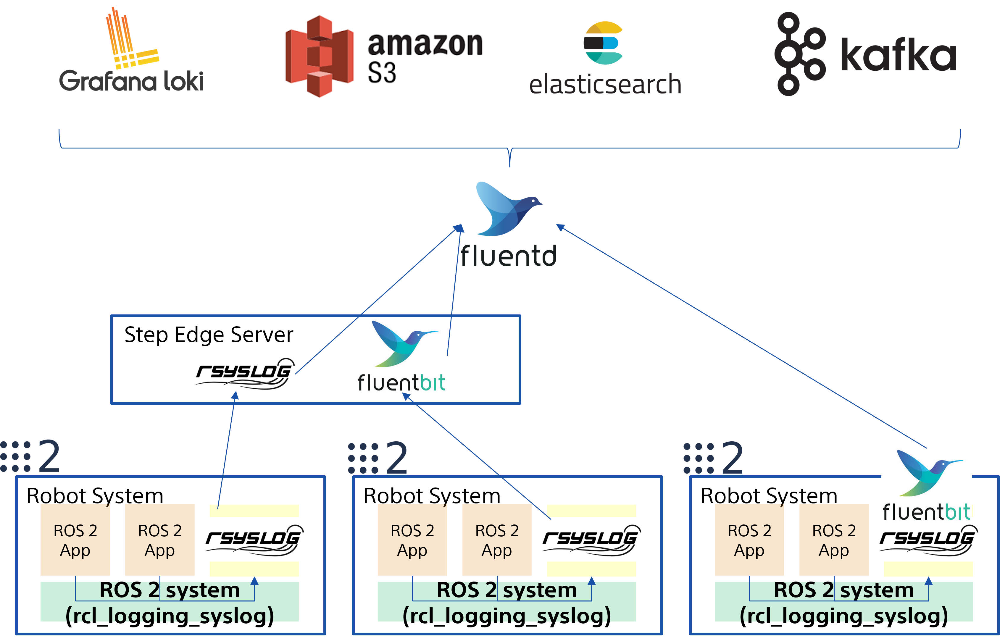

[](https://github.com/fujitatomoya/rcl_logging_syslog/actions/workflows/humble.yaml) [](https://github.com/fujitatomoya/rcl_logging_syslog/actions/workflows/jazzy.yaml) [](https://github.com/fujitatomoya/rcl_logging_syslog/actions/workflows/kilted.yaml) [](https://github.com/fujitatomoya/rcl_logging_syslog/actions/workflows/lyrical.yaml) [](https://github.com/fujitatomoya/rcl_logging_syslog/actions/workflows/rolling.yaml)
[](https://github.com/fujitatomoya/rcl_logging_syslog/actions/workflows/nightly.yaml)

# rcl_logging_syslog 🚢🚀🚂

[rcl_logging_syslog](https://github.com/fujitatomoya/rcl_logging_syslog) is alternative logging backend implementation that can be used for [ROS 2](https://github.com/ros2) application via [rcl_logging_interface](https://github.com/ros2/rcl_logging/tree/rolling/rcl_logging_interface).

[rcl_logging_syslog](https://github.com/fujitatomoya/rcl_logging_syslog) uses [SYSLOG(3)](https://man7.org/linux/man-pages/man3/syslog.3.html) to send the log data to [rsyslog](https://www.rsyslog.com/) a.k.a **rocket-fast system for log processing** 🚀.

The main objective is that **Enabling ROS 2 logging system with Cloud-Native Log Management and Observability**.



see [overview slide deck](https://raw.githack.com/fujitatomoya/rcl_logging_syslog/rolling/doc/overview.html) for more information.

## Motivation

The logging data is critical especially for entire system observability and status, so that application can alert the administrator or even give the feedback to the system with adjusting the parameter.
This importance rises once it comes to robotics and robot application, especially distributed system such as [ROS 2](https://github.com/ros2) or edge computing because we must be able to specify what went wrong in the 1st place with these logging data.

[rsyslog](https://www.rsyslog.com/) is available in default Ubuntu distribution managed by system service, performative, and many configuration supported including log data pipeline.
So that user can choose the logging configuration depending on the application requirement and use case, sometimes **file system sink**, sometimes **forwarding to remote rsyslogd**, or even **[FluentBit](https://github.com/fluent/fluent-bit)**.

[FluentBit](https://github.com/fluent/fluent-bit) is a **Fast Log Processor and Forwarder** part of Graduated [Fluentd](https://www.fluentd.org/) Ecosystem and a [CNCF](https://www.cncf.io/) sub-project.

## Demonstration

See how it works 🔥

- rsyslog / FluebtBit

https://github.com/user-attachments/assets/bdb05bf7-92b2-4b9a-8f20-3d3b803a7a86

- rsyslog / Fluentd / Loki / Grafana

https://github.com/user-attachments/assets/4a1aae42-5c55-4f31-9198-8c7c246244ca

## Tutorials

- [How to integrate with Fluentd / Loki / Grafana](./doc/tutorials/Fluentd_Loki_Grafana.md)

## Supported [ROS Distribution](https://docs.ros.org/en/rolling/Releases.html)

| Distribution      | Supported | Branch | Dynamic Loading |
| :---------------- | :-------- | :----- | :-------------- |
| Rolling Ridley    |    ✅    | `rolling` (Development) | ✅ |
| Lyrical Luth      |    ✅    | `lyrical` | ✅ |
| Kilted Kaiju      |    ✅    | `kilted`  | ❌ |
| Jazzy Jalisco     |    ✅    | `jazzy`  | ❌ |
| Humble Hawksbill  |    ✅    | `humble` | ❌ |

## `rcl_logging_implementation`

Starting with [Lyrical Luth](https://docs.ros.org/en/rolling/Releases/Release-Lyrical-Luth.html), ROS 2 introduces [`rcl_logging_implementation`](https://github.com/ros2/rcl_logging/tree/rolling/rcl_logging_implementation), a package that enables runtime dynamic loading of logging backends, similar to how [`rmw_implementation`](https://github.com/ros2/rmw_implementation) works for middleware selection.
This abstraction layer allows users to switch between different logging implementations (such as `rcl_logging_spdlog`, `rcl_logging_noop`, or `rcl_logging_syslog`) without rebuilding RCL or application code.

See the [ROS 2 Logging Documentation](https://docs.ros.org/en/rolling/Concepts/Intermediate/About-Logging.html#rcl-logging-implementation) for more details.

### Runtime Dynamic Loading vs Static Linking

The logging system supports two build configurations:

**Dynamic Loading (Default, Lyrical or later)**

By default, `rcl` links against `rcl_logging_implementation`, which dynamically loads the logging backend at runtime.
This approach provides maximum flexibility, allowing the logging implementation to be changed via the `RCL_LOGGING_IMPLEMENTATION` environment variable without recompilation.

- The logging implementation is loaded as a shared library at runtime.
- No rebuild of `rcl` is required to switch between logging implementations.
- Simply build `rcl_logging_syslog` and set the environment variable to use it.

**Static Linking (Kilted or older distributions)**

For Kilted, Jazzy, and Humble distributions, the `rcl_logging_implementation` package is not available.
Users must rebuild `rcl` with the `RCL_LOGGING_IMPLEMENTATION` CMake/environment variable set at build time to statically link `rcl_logging_syslog`.

- The specified implementation is statically linked into `rcl` at build time.
- Runtime switching is NOT available.
- Requires rebuilding `rcl` whenever you want to change the logging backend.

## Installation

### Prerequisites

- [rsyslog](https://www.rsyslog.com/) installation

[rcl_logging_syslog](https://github.com/fujitatomoya/rcl_logging_syslog) requires `rsyslog` package, which Ubuntu should have already in default.
But if you are using container, the situation is bit different from host system since there is no system services or `rsyslogd` is running by default.
In the case of container, we need to install `rsyslog` packages in the container root file system.

> [!NOTE]
> We can enable the container with host system privileges but that is NOT recommended, especially for security.

```bash
### Install rsyslog package
apt install rsyslog
```

- create `ros` directory for `rsyslog`.

The following commands require `root` permission.
`/var/log/ros` is the root directory for `rcl_logging_syslog`, all logs are expected to be stored under this root directory.

```bash
mkdir -p /var/log/ros
chown syslog:adm /var/log/ros
```

> [!WARNING]
> For production, user needs to configure appropriate group if necessary but owner should be `syslog`. Otherwise `rsyslogd` may meet the permission problem for the file system.

- [rsyslog](https://www.rsyslog.com/) service check

If you are running the application on host system, check the `rsyslog` system service.

```bash
systemctl status rsyslog
```

If you are running the application on container environment, start the `rsyslogd` daemon process.

```bash
/usr/sbin/rsyslogd -n -iNONE
```

Or you prefer to use `rsyslogd` in the host system from the application in the container, you need to bind the `/dev/log` to the container via `-v /dev/log:/dev/log`, so that the application running in the container can open the Unix Domain Socket for `rsyslogd` running in the host system.
In this setting, all `rsyslogd` configuration needs to be set in the host system.

- [fluent-bit](https://github.com/fluent/fluent-bit) installation

if you want to use `fluent-bit` to forward the logging data from `rsyslogd`, please follow [Fluent Bit Installation Manual](https://docs.fluentbit.io/manual/installation/linux/ubuntu) to install it.

```bash
### Check fluent-bit package is installed
dpkg -l fluent-bit
Desired=Unknown/Install/Remove/Purge/Hold
| Status=Not/Inst/Conf-files/Unpacked/halF-conf/Half-inst/trig-aWait/Trig-pend
|/ Err?=(none)/Reinst-required (Status,Err: uppercase=bad)
||/ Name           Version      Architecture Description
+++-==============-============-============-=================================
ii  fluent-bit     3.1.6        amd64        Fast data collector for Linux
```

### Build

Currently we need to build the source code if we want to use alternative logging backend with [ROS 2](https://github.com/ros2).
See more details for https://github.com/ros2/rcl/issues/1178.

Please follow [ROS 2 Official Development / Installation](https://docs.ros.org/en/rolling/Installation/Alternatives/Ubuntu-Development-Setup.html) to build the `rcl_logging_syslog` package below.

There are two ways to build and use `rcl_logging_syslog`: **dynamic loading** or **static linking**.
See more details in the [ROS 2 Logging Documentation](https://docs.ros.org/en/rolling/Concepts/Intermediate/About-Logging.html#rcl-logging-implementation) and the [`rcl_logging_implementation`](#rcl_logging_implementation) section above.

> [!WARNING]
> Kilted or older distributions only support **static linking** and require rebuilding `rcl`.
> See more details for https://github.com/ros2/rcl/issues/1178.

- Dynamic Loading (Lyrical or later, Recommended)

  With `rcl_logging_implementation` available, you only need to build `rcl_logging_syslog` and set the `RCL_LOGGING_IMPLEMENTATION` environment variable at runtime. No rebuild of `rcl` is required.

  ```bash
  cd <YOUR_WORKSPACE>/src
  git clone https://github.com/fujitatomoya/rcl_logging_syslog.git
  cd <YOUR_WORKSPACE>
  colcon build --symlink-install --packages-select rcl_logging_syslog
  ```

  Then, set the environment variable before running your application:

  ```bash
  export RCL_LOGGING_IMPLEMENTATION=rcl_logging_syslog
  ros2 run <package> <executable>
  ```

- Static Linking (Kilted or older)

  For distributions that do not have `rcl_logging_implementation`, you must rebuild `rcl` with the `RCL_LOGGING_IMPLEMENTATION` environment variable set at build time.

  ```bash
  cd <YOUR_WORKSPACE>/src
  git clone https://github.com/fujitatomoya/rcl_logging_syslog.git
  export RCL_LOGGING_IMPLEMENTATION=rcl_logging_syslog
  colcon build --symlink-install --cmake-clean-cache --packages-select rcl_logging_syslog rcl
  ```

### Test

Following to the previous build procedure, we need to copy [ros2-test.conf](./config/ros2-test.conf) to `/etc/rsyslog.d/`, and restart the `rsyslog`.

```bash
sudo cp ./config/ros2-test.conf /etc/rsyslog.d/
```

Then we can start the `colcon test`:

This test creates and uses `/var/log/ros/rcl_logging_syslog` directory in temporary for the test, and it checks the file existence and contents using `rcl_logging_syslog`.

```bash
colcon test --event-handlers console_direct+ --packages-select rcl_logging_syslog
```

### Configuration

If you are using **dynamic loading** (Lyrical or later), set the logging implementation via the `RCL_LOGGING_IMPLEMENTATION` environment variable at runtime.
If you are using **static linking** (Kilted or older), the logging implementation is already linked into `rcl` at build time and this environment variable has no effect.

```bash
export RCL_LOGGING_IMPLEMENTATION=rcl_logging_syslog
# then run our application. e.g. "ros2 run <package> <executable>"
```

See more details for [`rcl_logging_implementation`](#rcl_logging_implementation) and the [ROS 2 Logging Documentation](https://docs.ros.org/en/rolling/Concepts/Intermediate/About-Logging.html#rcl-logging-implementation).

[SYSLOG(3)](https://man7.org/linux/man-pages/man3/syslog.3.html) is really simple that does not have much interfaces to control on application side, it just writes the log data on `rsyslog` Unix Domain Socket.
So we need to configure `rsyslog` how it manages the log message with `/etc/rsyslog.conf`, for example file system sink and forward the message to `fluent-bit`.

| environmental variable | default | Note |
| :----------------------| :------ | :--- |
| `RCL_LOGGING_SYSLOG_FACILITY` | `LOG_LOCAL1` | [syslog facility](https://man7.org/linux/man-pages/man3/syslog.3.html): either of `LOG_CRON`, `LOG_DAEMON`, `LOG_SYSLOG`, `LOG_USER`, and `LOG_LOCAL0-7`. (`/etc/rsyslog.conf` must be configured accordingly.) |

Examples:

```bash
export RCL_LOGGING_SYSLOG_FACILITY="LOG_LOCAL2"
```

See more details for https://www.rsyslog.com/doc/index.html.

#### `rsyslog`

Copy [ros2-logging.conf](./config/ros2-logging.conf) to `/etc/rsyslog.d/`, and replace `<FLUENTBIT_IP>` with your own IP address where `fluent-bit` listens on.

```bash
sudo cp ./config/ros2-logging.conf /etc/rsyslog.d/
```

Check the configuration file to see if there is no error,

```bash
rsyslogd -N1
rsyslogd: version 8.2312.0, config validation run (level 1), master config /etc/rsyslog.conf
rsyslogd: End of config validation run. Bye.
```

then, restart the `rsyslog` system service, or simply restart `rsyslog` daemon when using container.

```bash
### via systemd (not container environment)
sudo systemctl restart rsyslog
systemctl status rsyslog

### container environment
/usr/sbin/rsyslogd -n -iNONE
```

#### [fluent-bit](https://github.com/fluent/fluent-bit)

With above configuration, `rsyslogd` also sends log data to TCP port 5140 that `fluent-bit` listens with the following configuration.
Replace `<FLUENTBIT_IP>` with your own IP address in `fluent-bit.conf`.

```bash
### Create working directory
mkdir fluentbit_ws; cd fluentbit_ws

### Copy the original files to the local directory
cp -rf /etc/fluent-bit/fluent-bit.conf fluent-bit.conf
cp -rf /etc/fluent-bit/parsers.conf parsers.conf

### Modify the configuration as below
cat fluent-bit.conf
[SERVICE]
    Flush        1
    Parsers_File parsers.conf

[INPUT]
    Name     syslog
    Parser   syslog-rfc3164
    Listen   <FLUENTBIT_IP>
    Port     5140
    Mode     tcp

[OUTPUT]
    Name     stdout
    Match    *

# Start fluent-bit
/opt/fluent-bit/bin/fluent-bit --config=./fluent-bit.conf
```

## Usage

Logging messages from ROS 2 application will be sent to `rsyslogd` and forwarded to `fluent-bit` if that is configured.

### Examples

The following is an example output for file system and [fluent-bit](https://github.com/fluent/fluent-bit).

Start ROS 2 demo application:

```bash
ros2 run demo_nodes_cpp talker
[INFO] [1724453270.445092186] [talker]: Publishing: 'Hello World: 1'
[INFO] [1724453271.444981999] [talker]: Publishing: 'Hello World: 2'
[INFO] [1724453272.445056310] [talker]: Publishing: 'Hello World: 3'
...
```

Logging files under file system:

With example configuration and template above, file name is `<PROGRAMNAME>_<PID>_<YEAR>-<MONTH>-<DATE>.log`.
And log data is prefixed with hostname, facility name, log level and program name as well.

```bash
root@tomoyafujita:/var/log# find ros
ros
ros/tomoyafujita
ros/tomoyafujita/talker_31348_2024-08-28.log

root@tomoyafujita:/var/log# cat ros/tomoyafujita/talker_31348_2024-08-28.log
Aug 28 11:30:18 tomoyafujita local1.info: talker[31348]: [INFO] [1724869818.620827927] [talker]: Publishing: 'Hello World: 1'
Aug 28 11:30:19 tomoyafujita local1.info: talker[31348]: [INFO] [1724869819.620758249] [talker]: Publishing: 'Hello World: 2'
Aug 28 11:30:20 tomoyafujita local1.info: talker[31348]: [INFO] [1724869820.620777277] [talker]: Publishing: 'Hello World: 3'
```

FluentBit output:

```bash
/opt/fluent-bit/bin/fluent-bit --config=./fluent-bit.conf
Fluent Bit v3.1.6
* Copyright (C) 2015-2024 The Fluent Bit Authors
* Fluent Bit is a CNCF sub-project under the umbrella of Fluentd
* https://fluentbit.io

______ _                  _    ______ _ _           _____  __
|  ___| |                | |   | ___ (_) |         |____ |/  |
| |_  | |_   _  ___ _ __ | |_  | |_/ /_| |_  __   __   / /`| |
|  _| | | | | |/ _ \ '_ \| __| | ___ \ | __| \ \ / /   \ \ | |
| |   | | |_| |  __/ | | | |_  | |_/ / | |_   \ V /.___/ /_| |_
\_|   |_|\__,_|\___|_| |_|\__| \____/|_|\__|   \_/ \____(_)___/

[2024/08/23 16:02:00] [ info] [fluent bit] version=3.1.6, commit=, pid=1686882
[2024/08/23 16:02:00] [ info] [storage] ver=1.5.2, type=memory, sync=normal, checksum=off, max_chunks_up=128
[2024/08/23 16:02:00] [ info] [cmetrics] version=0.9.4
[2024/08/23 16:02:00] [ info] [ctraces ] version=0.5.5
[2024/08/23 16:02:00] [ info] [input:syslog:syslog.0] initializing
[2024/08/23 16:02:00] [ info] [input:syslog:syslog.0] storage_strategy='memory' (memory only)
[2024/08/23 16:02:00] [ info] [in_syslog] TCP server binding 43.135.146.89:5140
[2024/08/23 16:02:00] [ info] [sp] stream processor started
[2024/08/23 16:02:00] [ info] [output:stdout:stdout.0] worker #0 started
...
[0] syslog.0: [[1724844661.000000000, {}], {"pri"=>"142", "time"=>"Aug 28 11:31:01", "host"=>"tomoyafujita", "ident"=>"talker", "pid"=>"31348", "message"=>"[INFO] [1724869861.620769614] [talker]: Publishing: 'Hello World: 44'"}]
[0] syslog.0: [[1724844662.000000000, {}], {"pri"=>"142", "time"=>"Aug 28 11:31:02", "host"=>"tomoyafujita", "ident"=>"talker", "pid"=>"31348", "message"=>"[INFO] [1724869862.620773450] [talker]: Publishing: 'Hello World: 45'"}]
[0] syslog.0: [[1724844663.000000000, {}], {"pri"=>"142", "time"=>"Aug 28 11:31:03", "host"=>"tomoyafujita", "ident"=>"talker", "pid"=>"31348", "message"=>"[INFO] [1724869863.620773763] [talker]: Publishing: 'Hello World: 46'"}]
...
```

## Reference

- https://www.rsyslog.com/doc/index.html
- https://docs.fluentbit.io/manual
- [ROS by the Bay 20250130 Presentation](https://raw.githack.com/fujitatomoya/rcl_logging_syslog/rolling/doc/presentation/ROS-By-The-Bay_20250130.html)
