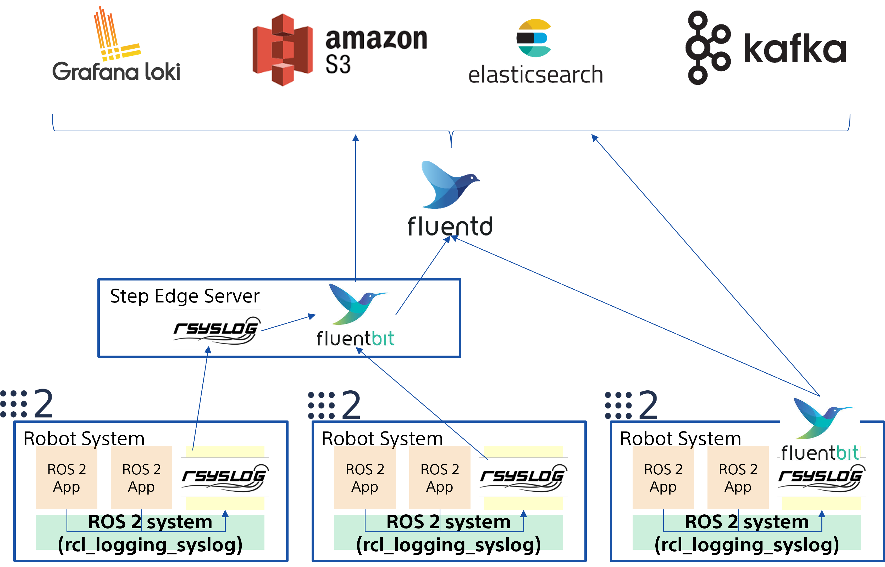

# ROS 2 Logging Subsystem

- ROS 2 provides a flexible and configurable logging subsystem.
- Supports multiple logging backends.
  - `stdout`: Logs are printed to the standard output (default ON to console).
  - `rosout`: Logs are published to the `/rosout` topic. (default ON)
  - <span style="color: red;">**external**: default [spdlog](https://github.com/gabime/spdlog), or your own implementation.</span> :rocket:**TODAY's TOPIC**:rocket:

<!---
Comment Here
--->

---

## Enabling and Disabling Logging Backends

- Node option in the program. (e.g `rclcpp::NodeOptions`)
- Global ROS arguments via CLI. (can be overridden by `NodeOptions`)

  ```bash
  # Disabling rosout log publisher
  ros2 run foo_pkg bar_exec --ros-args --disable-rosout-logs
  
  # Disabling console output
  ros2 run foo_pkg bar_exec --ros-args --disable-stdout-logs
  
  # Disable any external loggers
  ros2 run foo_pkg bar_exec --ros-args --disable-external-lib-logs
  ```

<!---
Comment Here
--->

---

# Logging Severity Level

- `DEBUG`, `INFO`, `WARN`, `ERROR` and `FATAL`.
- A logger will only process log messages with severity at or higher than a specified level chosen for the logger.
- Logger names represent a hierarchy.
  - If the level of a logger named `abc.def` is unset, it will defer to the level of its parent named `abc`, and if that level is also unset, the global default logger level will be used. When the level of logger `abc` is changed, all of its descendants (e.g. `abc.def`, `abc.ghi.jkl`) will have their level impacted unless their level has been explicitly set.

<!---
Comment Here
--->

---

# For more information about ROS 2 logging...

- [logging level configuration service (default OFF)](https://docs.ros.org/en/rolling/Tutorials/Demos/Logging-and-logger-configuration.html#logger-level-configuration-externally)
- [logging level configuration via CLI](https://docs.ros.org/en/rolling/Tutorials/Demos/Logging-and-logger-configuration.html#logger-level-configuration-command-line)
- Console [output format](https://docs.ros.org/en/rolling/Tutorials/Demos/Logging-and-logger-configuration.html#console-output-formatting) and [output colorizing](https://docs.ros.org/en/rolling/Tutorials/Demos/Logging-and-logger-configuration.html#console-output-colorizing)
- [Setting the log file name prefix](https://docs.ros.org/en/rolling/Tutorials/Demos/Logging-and-logger-configuration.html#setting-the-log-file-name-prefix)
- [logging environmental variables](https://docs.ros.org/en/rolling/Concepts/Intermediate/About-Logging.html#environment-variables)

<!---
Comment Here
--->

---

# [rcl_logging_syslog](https://github.com/fujitatomoya/rcl_logging_syslog)


- ROS 2 rcl logging implementation built on top of [syslog(3)](https://man7.org/linux/man-pages/man3/syslog.3.html).
- Connects with [rsyslog](https://www.rsyslog.com/) and [FluentBit](https://fluentbit.io/) / etc...

<!---
Comment Here
--->

---


<!---
All available distributions are supported.
--->

---

# Objectives

- Configure log behavior without code change.
- Multiple sink with different logging level filtering.
- Reasonable Performance.
- Log data pipeline and forward capability support.
- Enabling ROS 2 logging system with Cloud-Native Log Management and Observability.

<!---
Comment Here
--->

---



<!---
This logging design is just one of the example can be supported by the architecture.
rsyslog and FluentBit enables user to support any log data pipeline with security TLS.
Even more, this architecture can take advantage of Cloud-Native services and tools.
--->

---

# [Demo FluentBit](https://github.com/user-attachments/assets/bdb05bf7-92b2-4b9a-8f20-3d3b803a7a86)

<video controls="controls" width="1000" src="https://github.com/user-attachments/assets/bdb05bf7-92b2-4b9a-8f20-3d3b803a7a86">

<!---
Comment Here
--->

---

# [Demo Fluentd/Loki/Grafana](https://github.com/user-attachments/assets/4a1aae42-5c55-4f31-9198-8c7c246244ca)

<video controls="controls" width="1100" src="https://github.com/user-attachments/assets/4a1aae42-5c55-4f31-9198-8c7c246244ca">

<!---
Comment Here
--->

---

# [rsyslog](https://www.rsyslog.com/)

## a.k.a rocket-fast system for log processing 🚀🚀🚀

[rsyslog](https://www.rsyslog.com/) is available in default Ubuntu distribution managed by system service, performative, and many configuration supported including log data pipeline.
So that user can choose the logging configuration depending on the application requirement and use case, sometimes file system sink, sometimes forwarding to remote rsyslogd, or even [FluentBit](https://github.com/fluent/fluent-bit).

<!---
SYSLOG(3) is really simple that does not have much interfaces to control on application side, it just writes the log data on rsyslog Unix Domain Socket.
--->

---

# [FluentBit](https://github.com/fluent/fluent-bit)


<!---
This is just the logging data pipeline only.
For the final destination like data base, that likely is dependent on application business logics.
For example, InfluxDB, ElasticSearch and so on, that are out of scope from this project.
--->

---

- Lightweight and Efficient: **suitable for environments with limited computational power**.
- High Performance: **capable of handling high-volume data streams with minimal latency.** It leverages asynchronous I/O and efficient data processing techniques to ensure optimal performance.
- Flexibility: supports **a wide range of data sources and destinations**.
- Extensibility: highly extensible through plugins including custom ones.
- Scalability: easily **scaled horizontally** to handle increasing data volumes by deploying multiple instances.
- Reliability: **features like fault tolerance and retry mechanisms** to ensure data reliability.

<!---
Comment Here
--->

---

# [How to use](https://github.com/fujitatomoya/rcl_logging_syslog?tab=readme-ov-file#build)

```bash
export RCL_LOGGING_IMPLEMENTATION=rcl_logging_syslog
colcon build --symlink-install --cmake-clean-cache --packages-select rcl_logging_syslog rcl
```

- The pain is we always need to build for now... we cannot choose the external logger at runtime...
- [Feature Request: Select the logger without rebuilding](https://github.com/ros2/rcl/issues/1178), hopefully i could fix this in next release :thinking::thinking::thinking:
- If you use docker, either binding `-v /dev/log:/dev/log` or enable `rsyslogd` in the container.

<!---
Comment Here
--->

---

## Issues and PRs always welcome 🚀

source code, documentation, presentation slides, everything is here.

https://github.com/fujitatomoya/rcl_logging_syslog


<!---
Comment Here
--->
