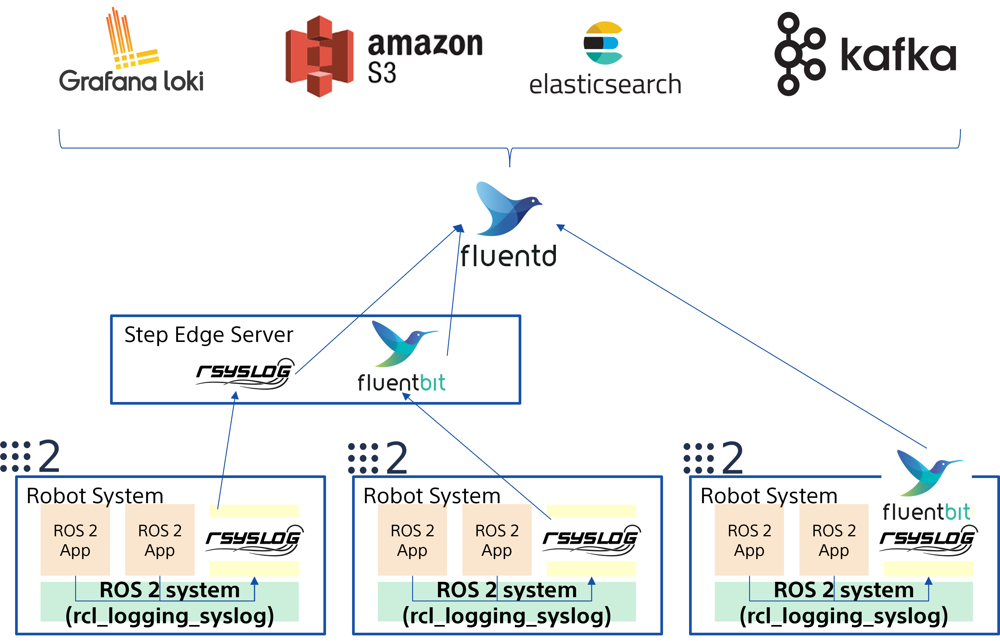

# [rcl_logging_syslog](https://github.com/fujitatomoya/rcl_logging_syslog)

- ROS 2 rcl logging implementation built on top of [syslog(3)](https://man7.org/linux/man-pages/man3/syslog.3.html).
- Connects with [rsyslog](https://www.rsyslog.com/) and [FluentBit](https://fluentbit.io/).

<!---
Comment Here
--->

---

<!---
All available distributions are supported.
--->

---

# Objectives

- Configure log behavior without code change.
- Multiple sink with different logging level filtering.
- Reasonable Performance. (like a 🚀🚀🚀)
- Log data pipeline and forward capability support.
- Enabling ROS 2 logging system with Cloud-Native Log Management and Observability.

<!---
Comment Here
--->

---

<!---
This logging design is just one of the example can be supported by the architecture.
rsyslog and FluentBit enables user to support any log data pipeline with security TLS.
Even more, this architecture can take advantage of Cloud-Native services and tools.
--->

---

# [rsyslog](https://www.rsyslog.com/)

## a.k.a rocket-fast system for log processing 🚀🚀🚀

[rsyslog](https://www.rsyslog.com/) is available in default Ubuntu distribution managed by system service, performative, and many configuration supported including log data pipeline.
So that user can choose the logging configuration depending on the application requirement and use case, sometimes file system sink, sometimes forwarding to remote rsyslogd, or even [FluentBit](https://github.com/fluent/fluent-bit).

<!---
SYSLOG(3) is really simple that does not have much interfaces to control on application side, it just writes the log data on rsyslog Unix Domain Socket.
--->

---

## Issues and PRs always welcome 🚀

https://github.com/fujitatomoya/rcl_logging_syslog

<!---
Comment Here
--->
